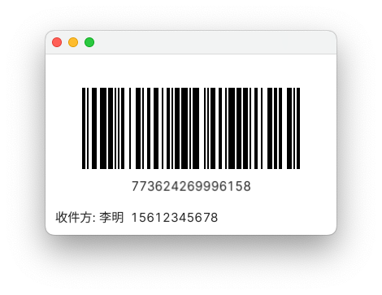

# 快递单号条形码生成器

工作中经常需要一个快递面单进行扫码识别，因此写了这样一个小工具，可以随机生成一个快递单号，并显示为条形码，并且带上收件人姓名和手机号，这是我的go语言练手之作。

## 使用

### 截图



如果文字显示乱码或需要更换为其他字体，可以设置 `FYNE_FONT` 环境变量，值为ttf字体文件的绝对路径，然后重启app。只支持ttf字体。

```bash
export FYNE_FONT="/path/to/your/font/file.ttf"
```

### 快捷键

| 按键           | 说明                                                           |
| :---:          | ---                                                            |
| `b`            | 显示/隐藏条形码下的运单号、货架号                              |
| `n`            | 显示/隐藏姓名                                                  |
| `m`            | 显示/隐藏手机号                                                |
| `<space>`      | 重新生成一个条形码                                             |
| `r`            | 重新生成一个条形码                                             |
| `h`            | 随机生成一个货架码                                             |
| `s`            | 开启/关闭自动更新条形码，更新频率可通过配置文件修改            |
| `o`            | 将运单号数字减1                                                |
| `p`            | 将运单号数字加1                                                |
| `数字<cr>`     | 使用输入的数字作为 shipid 生成条形码，详见 [快递单号](#快递单号) |
| `ctrl/cmd + c` | 将显示的条码对应的运单号复制到系统剪贴板                       |
| `ctrl/cmd + v` | 根据剪贴板内的运单号生成条码                                   |
| `ctrl/cmd + r` | 重新读取配置文件，改变显示内容                                 |

### 配置文件

软件没有配置文件的情况下也是可以正常使用的，只是不能修改姓名、手机号，这里提供了使用配置文件修改姓名、手机号的方式。

将 `barcode.yaml` 文件可存放在以下三个位置中的任意一个，按优先级排序

- `$XDG_CONFIG_HOME/barcode/barcode.yaml`
- `~/.config/barcode/barcode.yaml`
- `~/.barcode.yaml`

对于Windows用户，直接放在 `C:\Users\<your-username>\.barcode.yaml` 即可，注意文件名是 `.barcode.yaml`

修改配置文件后，保存，然后重启app，或者按快捷键 `ctrl/cmd + r` 即可重新读取配置文件。

### 快递单号

| 快递公司id | 生成单号格式       | 快递公司名称 |
| :---:      | -----              | ------       |
| 1          | 773 + 12位随机数字 | 申通快递     |
| 85         | YT4 + 12位随机数字 | 圆通快递     |
| 44         | SF + 13位随机数字  | 顺丰快递     |
| 115        | 753 + 11位随机数字 | 中通快递     |
| 119        | 58 + 10位随机数字  | 天天快递     |
| 118        | 12 + 11位随机数字  | 邮政EMS      |
| 131        | DPK + 12位随机数字 | 德邦快递     |
| 132        | 23 + 11位随机数字  | 邮政快递包裹 |
| 3          | 552 + 12位随机数字 | 百世快递     |
| 384        | JT + 13位随机数字  | 极兔速递     |
| 340        | JD + 13位随机数字  | 京东快递     |

## build

克隆仓库到本地

```bash
git clone https://github.com/vhqkze/Barcode.git
```

安装依赖

```bash
go mod tidy
```

编译为 macOS 安装包

```bash
fyne package -os darwin -icon ./barcode.png --name Barcode
```

编译为 Windows 安装包

```bash
fyne package -os windows -icon ./barcode.png --name Barcode
```

如果编译为 Windows 安装包失败，使用下面的命令

```bash
CGO_ENABLED=1 CC=x86_64-w64-mingw32-gcc CXX=x86_64-w64-mingw32-g++ GOOS=windows GOARCH=amd64 fyne package -os windows -icon ./barcode.png --name Barcode
```
